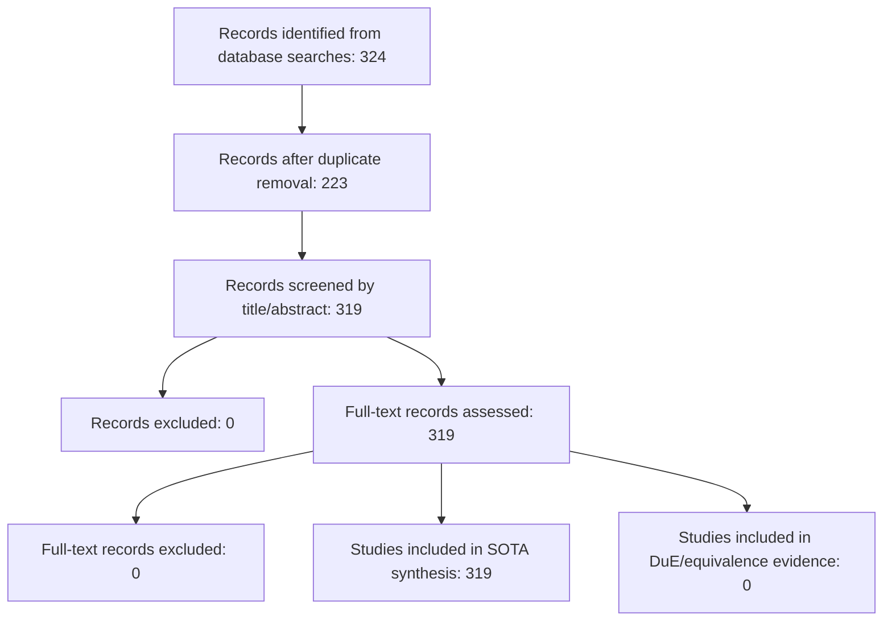

# PRISMA Flow Diagram

Note: this diagram is generated from the reproducible search and screening registry; final PRISMA reporting requires human confirmation of exclusions and full-text decisions.
