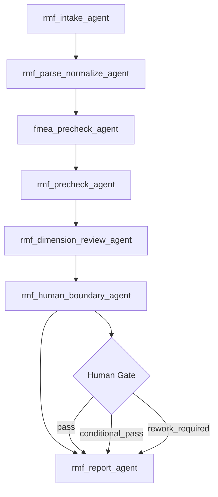

# DeerFlow RMF Review Workflow v1.1

## 1. 设计目标
- 先做一版 P0 最小可执行骨架，只支持单项目、单机构语境。
- 固化 BSI profile，不先做多机构策略切换。
- 以 RMF 为主审对象，将 CER / IFU / TD / PMS-PMCF 作为交叉验证输入。
- 明确纳入 FMEA / Hazard Analysis 评审，不允许只把它们隐含在 RMF 中。
- 所有结论型输出都要求 source binding / source ref。
- 最终结论必须经过人工 Gate，系统不得自动宣布最终合规。

## 2. 工作流总图



## 3. 7 节点说明

### rmf_intake_agent
- 检查核心输入是否齐套。
- 生成 `run_manifest`、`input_inventory`、`missing_items_report`。
- 明确标记 FMEA / Hazard Analysis 是否存在、是否可读。

### rmf_parse_normalize_agent
- 解析 RMF 主体。
- 抽取 FMEA / Hazard Analysis 为显式结构对象。
- 生成 `cross_doc_entities` 和 `term_map`。
- 所有结构对象支持 `source_ref`。

### fmea_precheck_agent
- 只做结构预审，不越权做 acceptability 结论。
- 关注 risk id、P/S、risk level / RPN、control、verification、residual risk、orphan / duplicate / empty rows、trace chain。

### rmf_precheck_agent
- 做 RMF 章节和规则化预检。
- 检查 RMF 基本章节、ISO 14971 引用、三步法、术语一致性。

### rmf_dimension_review_agent
- 按六维输出：
  - COMP 完整性
  - CORR 正确性
  - ADEQ 充分性
  - TRAC 可追溯性
  - CONS 一致性
  - ACPT 可接受性

### rmf_human_boundary_agent
- 明确机器不能闭环的事项。
- 输出 reviewer 待决项、证据来源、为什么不能自动判、reviewer focus。

### rmf_report_agent
- 生成最终 markdown report、json report、CAPA action list、backflow candidates。
- 只输出推荐结论与人审状态，不自动宣告最终合规。

## 4. 每个节点的输入输出

| 节点 | 主要输入 | 主要输出 |
| --- | --- | --- |
| `rmf_intake_agent` | `project_profile`、输入包 | `run_manifest`、`input_inventory`、`missing_items_report` |
| `rmf_parse_normalize_agent` | manifest、inventory、源文件 | `rmf_normalized`、`fmea_normalized`、`cross_doc_entities`、`term_map` |
| `fmea_precheck_agent` | `fmea_normalized` | `fmea_precheck_report` |
| `rmf_precheck_agent` | `rmf_normalized`、`fmea_precheck_report` | `rmf_precheck_report` |
| `rmf_dimension_review_agent` | precheck reports、normalized objects | `dimension_assessment` |
| `rmf_human_boundary_agent` | dimension assessment、precheck reports | `human_review_queue`、`provisional_gate_recommendation` |
| `rmf_report_agent` | 全部上游 artifacts + human gate | `final_report.md`、`final_report.json`、`capa_action_list.json`、`backflow_candidates.json` |

## 5. artifact 目录说明

建议按 DeerFlow thread output 风格，将 artifacts 固化到单次 run 目录：

```text
/mnt/user-data/outputs/rmf_review_v1_1/{run_id}/
├── 00_run_manifest/
├── 01_normalized/
├── 02_fmea_precheck/
├── 03_rmf_precheck/
├── 04_dimension_review/
├── 05_human_boundary/
└── 06_final/
```

说明：
- `00_run_manifest/`：输入盘点与缺失项
- `01_normalized/`：RMF/FMEA/Hazard Analysis 结构化对象
- `02_fmea_precheck/`：FMEA 结构预审结果
- `03_rmf_precheck/`：RMF 规则预审结果
- `04_dimension_review/`：六维评审
- `05_human_boundary/`：人工待决队列与 gate recommendation
- `06_final/`：最终报告、CAPA、backflow candidates

## 6. human gate 说明
- Human gate 是强制节点。
- 允许值：
  - `pass`
  - `conditional_pass`
  - `rework_required`
- 机器只能形成 `provisional_gate_recommendation`，不能形成最终 closure。
- 报告中必须将“机器判断”与“人工最终决定”分开表示。

## 7. P0 适用边界
- 单项目，不做 portfolio 级 orchestration。
- 单机构语境，先固定 BSI profile。
- 重点是跑通一个真实项目的 RMF review。
- 以 workflow / schema / prompt contracts / docs 为主，不假设 DeerFlow 已经内建原生 RMF runner。
- 不在 P0 处理复杂多语言对齐、自动法规知识库增强、跨项目学习闭环。

## 8. 后续升级路线

### P1
- 把 workflow yaml 与真实 DeerFlow runtime wiring 连接起来。
- 增加 per-step schema validation / repair loop。
- 增加 reviewer UI 或 artifact viewer 友好展示。

### P2
- 支持多机构 profile。
- 支持多项目批处理和 reusable pattern backflow。
- 支持更完整的 CER / PMS-PMCF 联动评估与指标化统计。
